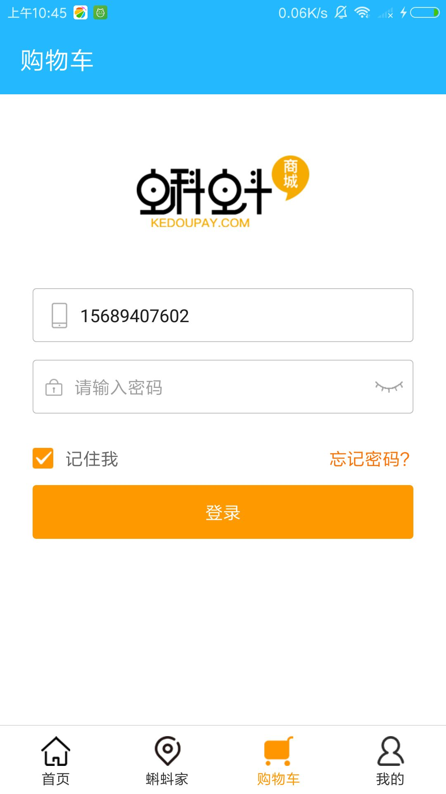

# kedou
 > 运用快应用 实现一个商城项目
 
 ### 安装运行
 ```
 1. git clone https://github.com/niuhuahua/kedou.git

 2. 运行`npm install` 安装依赖 建议用淘宝镜像 cnpm

 3. npm run server 
 
 4. npm run watch 

 可以安装调试工具 adb 比较方便调试项目 
 ```
 
 ### 效果图
 
 #### 登录
  
 
 
 
 
